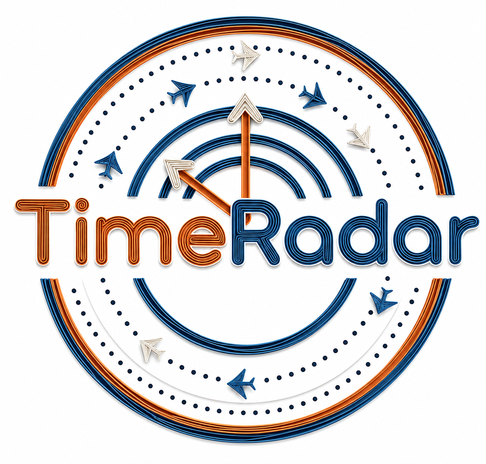

<div align="center">



## TimeRadar: A Domain-Rotatable Foundation Model for Time Series Anomaly Detection

[](https://arxiv.org/abs/2602.19068)
[]()
[](LICENSE)

</div>

---

## Overview

## Key Highlights


## Main Results


## Repository Structure


## Citation

If you find this work useful, please cite:


```

## License

- **Code** (`inference/`): MIT License — see [LICENSE](LICENSE).
- **Dataset** (HuggingFace `ZBox008003/AFTraj`): CC BY 4.0.

<div align="center"></div>
