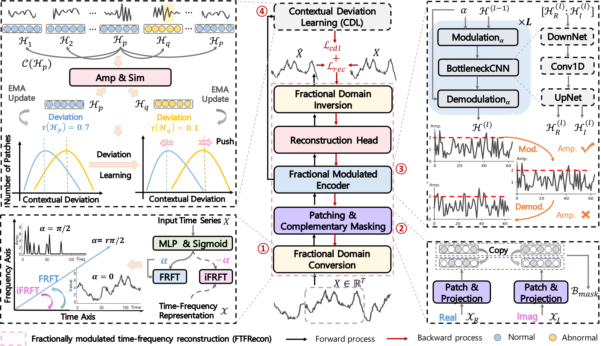

<div align="center">


## TimeRadar: A Domain-Rotatable Foundation Model for Time Series Anomaly Detection

[](https://arxiv.org/abs/2602.19068)
[]()

[](LICENSE)
[](https://opensource.org/licenses/Apache-2.0)

</div>

---


## Overview

We introduce **TimeRadar**, an innovative time series foundation model (TSFM) built in a **fractional time–frequency domain** to support generalist time series anomaly detection (TSAD) across diverse unseen datasets.  Our key insight is that rotating a time series into a **data-dependent fractional time–frequency representation** can adaptively differentiate normal and abnormal signals across different datasets. To this end, we propose a novel component, **Fractionally modulated Time-Frequency Reconstruction (FTFRecon)**, which leverages a **learnable fractional order** to rotate the time series to the most pronounced angle between the continuous time and frequency domains for accurate data reconstruction.   This design enables **adaptive reconstruction in an optimal time–frequency domain** for each input, effectively distinguishing **unbounded abnormal patterns** from regular ones across datasets, including previously unseen datasets.  To further capture **local abnormalities** that may not be reflected by global reconstruction, we introduce a **Contextual Deviation Learning (CDL)** component, which models the local deviation of the input relative to its contextual time series data in the rotatable domain.

<div align="center"></div>

## 📚 Data Preparation

The datasets can be downloaded from the following link [Google Drive](https://drive.google.com/file/d/1QumS8bSRsLZT7u5TWLaWctDWvGnSyeRB/view?usp=drive_link)

Place the extracted **Monash+** and **evaluation_dataset** directories under `./dataset`:

```text
dataset/
├── Monash+/
└── evaluation_dataset/
    ├── DETECT_META.csv
    └── data/
```

If you download the original Monash data instead of the processed Monash+ data, first place it at `./dataset/Monash` and generate Monash+ with:

```bash
sh ./anomaly_inject_Monash/gen_Monash.sh
```

## ⚙️ Installation

Install the dependencies listed in `requirements.txt`:

```bash
pip install -r requirements.txt
```

## 🏋️ Pretraining

To pretrain TimeRadar on Monash+, run:

```bash
bash ./scripts/pretrain/Monash_ADD.sh
```

The resulting checkpoint is saved under `./checkpoints`.

## 🔥 Few-shot Fine-tuning

Few-shot fine-tuning uses a small percentage of labeled training data from a target dataset. Set `--is_training 0`, `--is_finetuning 1`, and `--is_zeroshot 0`. Change `--percentage` to evaluate another few-shot setting.

## 🧊 Zero-shot Evaluation

For zero-shot anomaly detection, set `--is_training 0`, `--is_finetuning 0`, and `--is_zeroshot 1`. For example, evaluate TimeRadar on MSL with:

```bash
bash ./scripts/anomaly_detection/MSL.sh
```

We also provide a ready-to-use pretrained TimeRadar model under [`./TimeRadar`](./TimeRadar), packaged in the Hugging Face custom-model format similarly to [`./DADA`](./DADA). It can be loaded directly with `AutoModel.from_pretrained(..., trust_remote_code=True)`; see the [model README](./TimeRadar/README.md) for details.

### 🤖 Evaluating Other Foundation Models

To evaluate other advanced foundation models such as Chronos-Bolt, download the corresponding pretrained weights and place them under the local path expected by the implementation (for Chronos-Bolt, `./models/chronos/chronos-bolt-base`). Use the anomaly-detection scripts above and replace the task and model arguments with:

```bash
--task_name anomaly_detection_chronos \
--model Chronos-bolt
```

Forecasting-based foundation models require the `TrainSegLoaderAddPre` data-loader mapping documented in `data_provider/data_factory.py`.

## Citation

If you find this repository useful in your research or applications, please cite our paper:

```bibtex
@misc{he2026timeradar,
  title         = {TimeRadar: A Domain-Rotatable Foundation Model for Time Series Anomaly Detection},
  author        = {Hui He and Hezhe Qiao and Yutong Chen and Kun Yi and Guansong Pang},
  year          = {2026},
  eprint        = {2602.19068},
  archivePrefix = {arXiv},
  primaryClass  = {cs.LG},
  url           = {https://arxiv.org/abs/2602.19068}
}
```

## Acknowledgement

We appreciate the following GitHub repos for providing valuable code bases and efforts.

- DADA [\[repo\]](https://github.com/iambowen/DADA)
- SEMPO [\[repo\]](https://github.com/mala-lab/SEMPO)
- Time-MoE [\[repo\]](https://github.com/Time-MoE/Time-MoE)
- chronos-forecasting [\[repo\]](https://github.com/amazon-science/chronos-forecasting)
- TimesFM [\[repo\]](https://github.com/google-research/timesfm)
- CATCH [\[repo\]](https://github.com/decisionintelligence/CATCH)
- Large-Time-Series-Model [\[repo\]](https://github.com/thuml/Large-Time-Series-Model)
